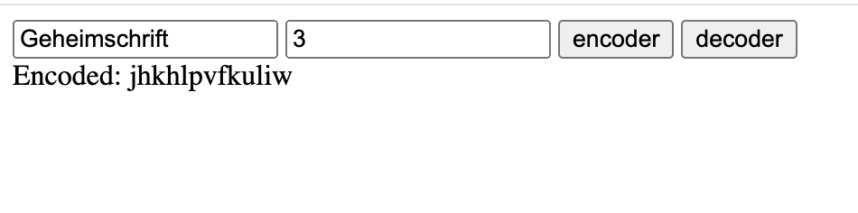

**Caesar-Verschlüsselung**

Für das Projekt Caesar-Verschlüsselung wurde eine Anwendung erstellt, die einen Text mithilfe des Caesar-Verfahrens verschlüsselt. 

**Funktionen**

Ein Text wird eingegeben. Man kann auf „encoder“ klicken, um den Text zu verschlüsseln. Genauso kann man einen bereits verschlüsselten Text eingeben und auf „decoder“ klicken, dann wird der Text entschlüsselt. Im Feld „key“ kann man eine Zahl,nden Schlüssel für die Verschiebung eingeben.

**Verwendete Technologien**

HTML,
TypeScript

**Vorschau**

